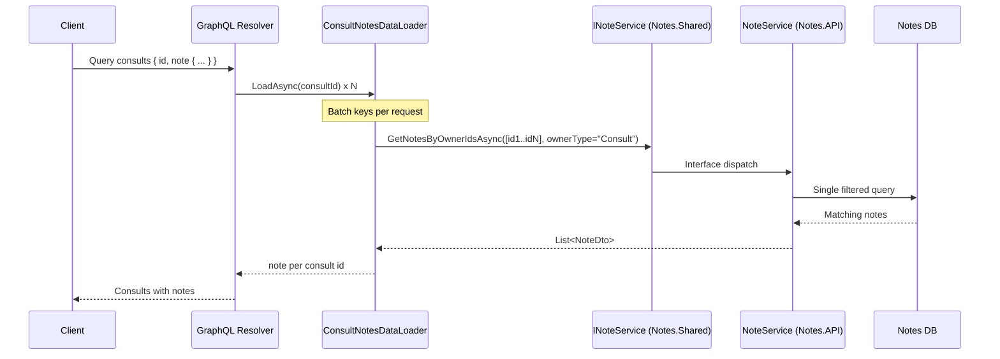

# DataLoaders in a Modular Monolith

This document explains what DataLoaders are, how they work in this repository, and why they are a strong fit for a modular monolith architecture.

## What a DataLoader Is

In GraphQL, a DataLoader is a request-scoped component that:

- batches many key lookups into one backend call
- caches results during a single GraphQL request
- prevents the N+1 query pattern in nested resolvers

In this repo, the DataLoader implementation is `BatchDataLoader<TKey, TValue>` from GreenDonut.

## Where It Is Used in This Repo

Main implementation:

- `Modules/Consults/Consults.API/Dataloaders/ConsultNotesDataLoader.cs`

Field resolver using the loader:

- `Modules/Consults/Consults.API/Types/ConsultTypeExtensions.cs`

Shared Notes contract used by Consults:

- `Modules/Notes/Notes.Shared/Services/INoteService.cs`
- `Modules/Notes/Notes.Shared/Dtos/NoteDto.cs`

Notes module implementation behind the shared contract:

- `Modules/Notes/Notes.API/Services/NoteService.cs`

## Request Flow (What Happens at Runtime)

When a query asks for consults and each consult's note:

1. GraphQL resolves consult list in `ConsultQuery`/`ConsultQueries`.
2. For each consult, `ConsultTypeExtensions.GetNoteAsync(...)` calls `ConsultNotesDataLoader.LoadAsync(consult.Id)`.
3. GreenDonut batches all consult ids requested in this execution window.
4. `ConsultNotesDataLoader.LoadBatchAsync(...)` calls `INoteService.GetNotesByOwnerIdsAsync(keys, ownerType: nameof(Consult), ...)` once.
5. Notes service fetches matching notes and returns DTOs.
6. DataLoader maps result by owner id and returns per consult field.

## Why This Is Useful in a Modular Monolith

DataLoaders are not only about performance. In a modular monolith they also reinforce boundaries:

- Consults does not reach into Notes internals; it calls `Notes.Shared` contracts.
- Notes owns query rules and storage details in `Notes.API`/`Notes.Infrastructure`.
- The composition stays in-process (fast) while still modular (clean dependencies).
- Request-scoped cache avoids repeated cross-module calls for the same key in one GraphQL request.

This fits the same boundary rule described in `docs/modular-monolith.md`: cross-module communication goes through shared contracts.

## Why It Is Better Than "Load All Notes and Join in the Client"

### Short answer

Loading all notes and joining in the client is simpler only for tiny datasets. It quickly becomes expensive, leaky, and hard to keep correct.

### Concrete comparison

Assume:

- 50 consults on the current page
- 10,000 notes total in the system
- average serialized note payload around 400 bytes

If client loads all notes:

- transfers about `10,000 * 400B = ~4 MB` of note data (before protocol overhead)
- client must filter/join locally for only 50 consult ids
- data may include unrelated notes the user did not need for this screen

If server uses DataLoader batching:

- transfers only notes for those 50 consults (often tens of KB, not MB)
- backend applies authoritative filters (`ownerType`, keys, optional note type)
- one batched cross-module call instead of broad data export

### Side-by-side

| Dimension | Load all notes + client join | DataLoader + shared service |
| --- | --- | --- |
| Data transferred | Very high at scale | Minimal for current request |
| Query pattern | Broad fetch, often wasteful | Keyed, batched, targeted |
| Pagination fit | Poor (consult page vs all notes) | Natural (same page keys) |
| Security exposure | Higher risk of oversharing | Only needed rows returned |
| Rule consistency | Duplicates logic in client | Centralized in Notes module |
| Modularity | Weakens boundaries | Preserves module contracts |

## Practical Guidance and Pitfalls

- Use stable keys (`Guid` consult id in this repo).
- Keep DataLoader request-scoped (default behavior in GraphQL server).
- Always pass cancellation tokens through batch and service methods.
- Return dictionary entries keyed exactly by requested ids.
- Apply filtering in the owning module (Notes), not in UI.
- If relation becomes one-to-many, prefer grouped loaders (`IReadOnlyList<TValue>` per key) over a single-value map.

## Takeaway

In a modular monolith, DataLoaders give you both:

- performance (batching + request cache)
- architecture safety (cross-module access through shared contracts only)

That makes them a strong default for GraphQL field composition across module boundaries.
