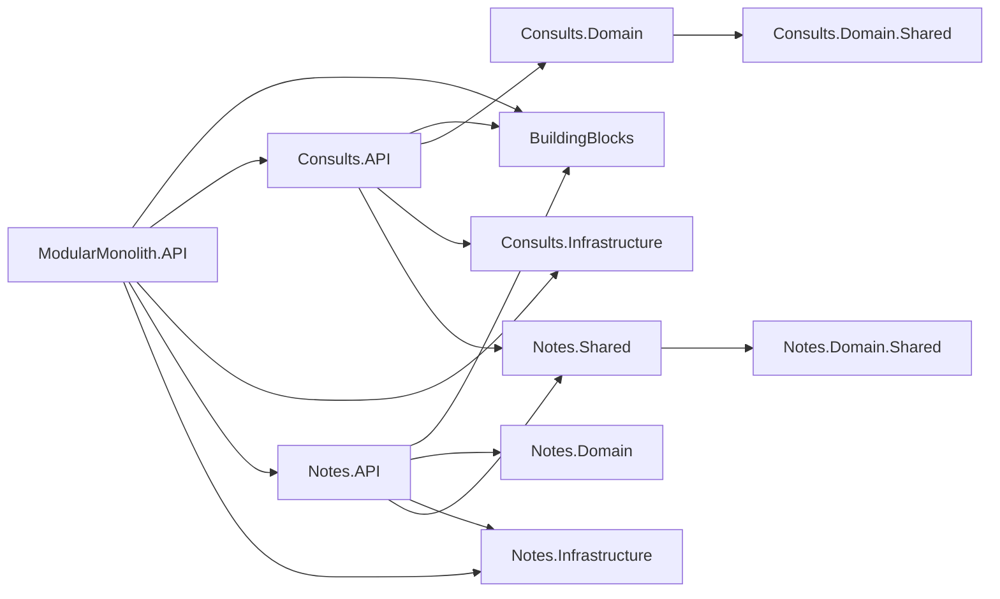

# Modular Monolith in This Repository

This repository is a modular monolith: one deployable application process (`ModularMonolith.API`) composed of multiple business modules (`Consults`, `Notes`) with explicit dependency boundaries.

The key principle used here is:

- A module can expose a **Shared** contract package for other modules.
- Other modules should depend on that shared contract package, not on internal domain/infrastructure of the module.

## Module Layout

From `ModularMonolith.sln`, each module is split into projects:

- `*.Domain.Shared`: shared domain enums/value types for that module
- `*.Domain`: internal domain entities
- `*.Infrastructure`: persistence and infrastructure (EF Core, DbContext)
- `*.API`: module application/API surface (GraphQL types, handlers)
- `*.Shared` (optional): cross-module contracts (commands, DTOs, services)

In this repo:

- `Consults`: `Consults.Domain.Shared`, `Consults.Domain`, `Consults.Infrastructure`, `Consults.API`
- `Notes`: `Notes.Domain.Shared`, `Notes.Domain`, `Notes.Infrastructure`, `Notes.API`, `Notes.Shared`

## Dependency Diagram

This shows the important boundary: `Consults.API` depends on `Notes.Shared`, not on `Notes.Domain` or `Notes.Infrastructure`.

## Concrete Example: Consults Uses Only Notes Shared Contracts

The dependency is declared in `Modules/Consults/Consults.API/Consults.API.csproj` via:

- `ProjectReference` to `..\..\Notes\Notes.Shared\Notes.Shared.csproj`

There are no `ProjectReference` entries from any `Consults.*` project to:

- `Modules/Notes/Notes.Domain/Notes.Domain.csproj`
- `Modules/Notes/Notes.Infrastructure/Notes.Infrastructure.csproj`
- `Modules/Notes/Notes.API/Notes.API.csproj`

### Write Flow (Consult creation with Note)

`Consults.API` creates a consult, then calls Notes through a shared command contract:

1. `Modules/Consults/Consults.API/Commands/AddConsultCommandHandler.cs`
2. Creates `Notes.Shared.Commands.AddNoteCommand`
3. Sends command through MediatR (`ISender`)
4. `Notes.API` handles it in `Modules/Notes/Notes.API/Commands/AddNoteCommandHandler.cs`

Result: Consults can request note creation without depending on Notes internal implementation.

### Read Flow (Consult note projection)

`Consults.API` resolves note data using shared service contracts:

1. `Modules/Consults/Consults.API/Dataloaders/ConsultNotesDataLoader.cs`
2. Depends on `Notes.Shared.Services.INoteService`
3. Notes implements the service in `Modules/Notes/Notes.API/Services/NoteService.cs`
4. GraphQL extension (`Modules/Consults/Consults.API/Types/ConsultTypeExtensions.cs`) loads note by consult id

Result: Consults reads note data through interface + DTO contracts from `Notes.Shared`.

## Runtime Composition Model

The monolith composes modules at startup instead of running separate services.

1. `ModularMonolith.API/Program.cs` builds a single ASP.NET Core app.
2. It discovers module installers using `BuildingBlocks/Extensions/ModuleInstallerExtensions.cs`.
3. Installers implement `BuildingBlocks/IModuleInstaller.cs` and are provided by each module:
   - `Modules/Notes/Notes.API/Module.cs`
   - `Modules/Consults/Consults.API/Module.cs`
4. Each module registers DI services and GraphQL schema extensions into the same runtime.

So modules are independently structured, but deployed together in one process.

## Data Boundaries

Each module owns its own persistence model and DbContext:

- `Consults`: `Modules/Consults/Consults.Infrastructure/ConsultDbContext.cs`
- `Notes`: `Modules/Notes/Notes.Infrastructure/NotesDbContext.cs`

Connection strings are separate in `ModularMonolith.API/appsettings.json`:

- `ConnectionStrings:Consults`
- `ConnectionStrings:Notes`

In development, both contexts are migrated at startup (`ModularMonolith.API/Program.cs` + `ModularMonolith.API/Extensions/DbMigrationExtensions.cs`).

## Dependency Rules Used in This Repo

Allowed:

- `ModuleX.API -> ModuleX.Domain/Infrastructure/Domain.Shared`
- `ModuleX.Domain -> ModuleX.Domain.Shared`
- `ModuleY.API -> ModuleX.Shared` (cross-module contracts only)

Not allowed (by convention):

- `ModuleY.* -> ModuleX.Domain`
- `ModuleY.* -> ModuleX.Infrastructure`
- `ModuleY.* -> ModuleX.API`

This is what keeps modules decoupled while still enabling collaboration inside one monolith.

## How to Add a New Cross-Module Integration

Use this pattern when Module A needs behavior/data from Module B:

1. Add contracts to `ModuleB.Shared` (DTOs, commands, interfaces).
2. Reference only `ModuleB.Shared` from `ModuleA.API`.
3. Implement handlers/services in `ModuleB.API` using `ModuleB` internals.
4. Keep `ModuleA` free from references to `ModuleB.Domain` and `ModuleB.Infrastructure`.
5. Register implementations in `ModuleB` installer (`IModuleInstaller.Install`).

Following this pattern preserves modular boundaries while keeping operational simplicity of a single deployable unit.
